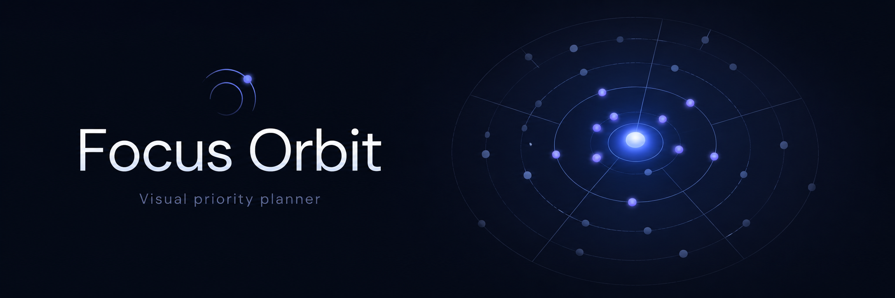
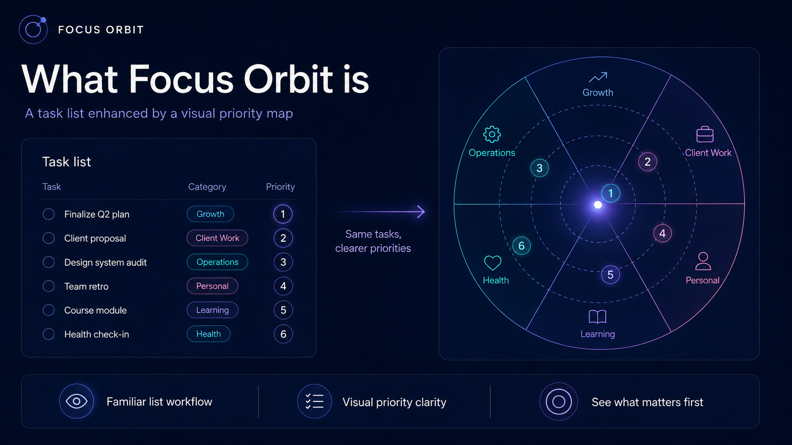
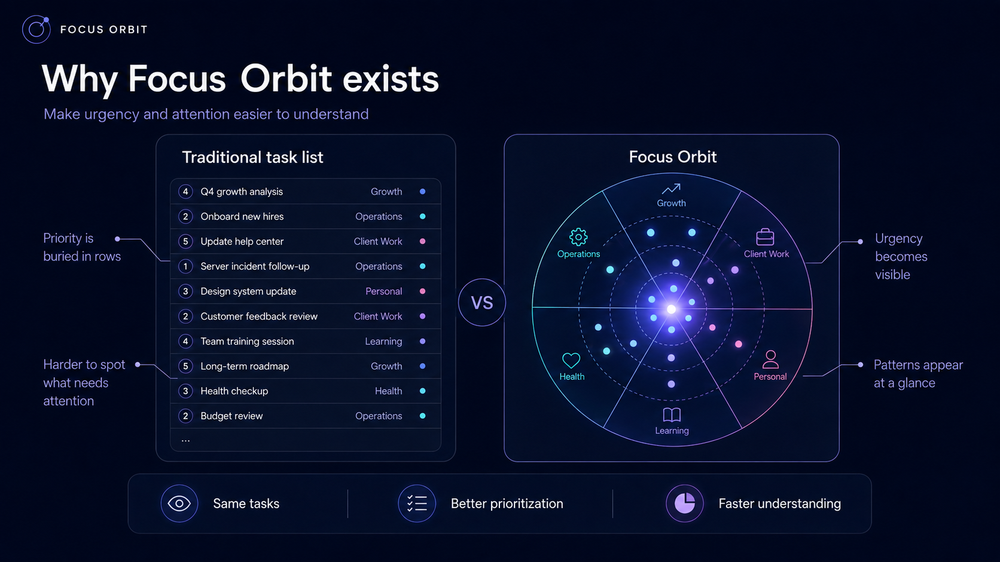
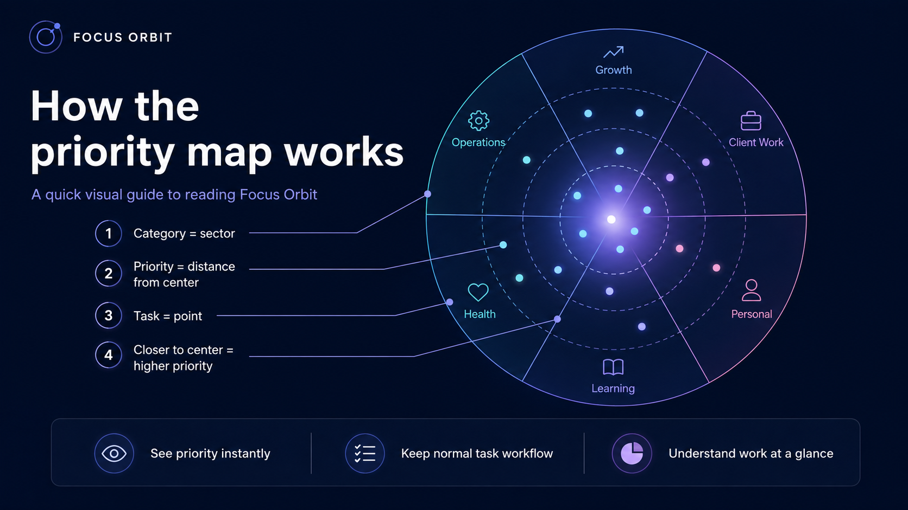
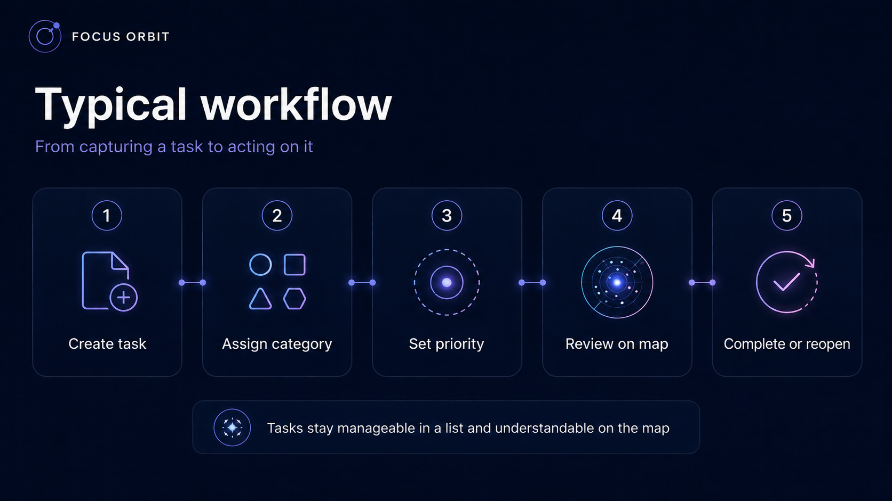
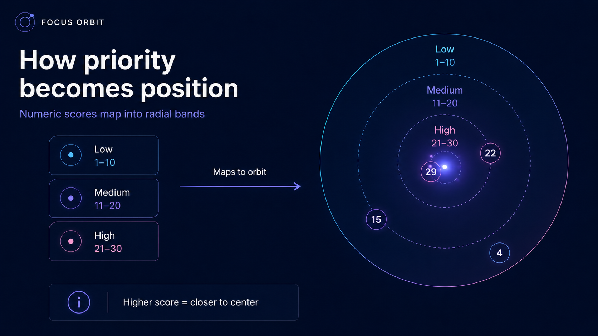
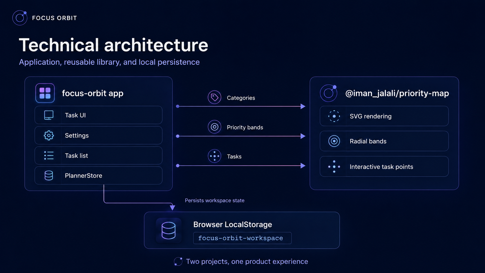
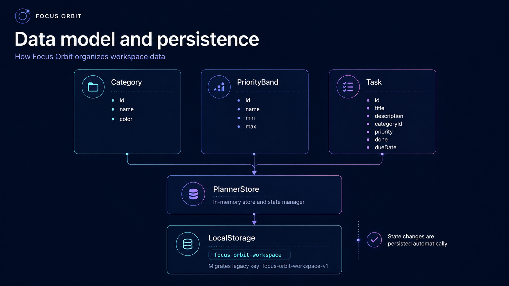

# Focus Orbit

**Focus Orbit is a visual priority planner that helps you see what deserves attention first.**

Instead of representing priority only with numbers, labels, or sorted rows, Focus Orbit turns a normal task list into a spatial priority map.

Tasks are grouped by category and positioned according to their priority.

> **The closer a task is to the center, the more attention it needs.**

Focus Orbit keeps the familiar task-list workflow while adding a visual way to understand urgency, workload, and priority at a glance.

## Demo

[▶ Watch the Focus Orbit demo](docs/focus%20orbit.mp4)

---

## Table of Contents

* [What Focus Orbit Is](#what-focus-orbit-is)
* [Why It Exists](#why-it-exists)
* [How to Read the Priority Map](#how-to-read-the-priority-map)
* [Typical Workflow](#typical-workflow)
* [What You Can Do](#what-you-can-do)
* [How Priority Works](#how-priority-works)
* [Technical Architecture](#technical-architecture)
* [Technology](#technology)
* [Getting Started](#getting-started)
* [Available Scripts](#available-scripts)
* [Reusable Priority Map Library](#reusable-priority-map-library)
* [Application Data Model](#application-data-model)
* [Persistence](#persistence)
* [Repository Structure](#repository-structure)
* [Accessibility](#accessibility)
* [Customization](#customization)
* [Production Considerations](#production-considerations)

---

## What Focus Orbit Is

Most task managers answer:

> What tasks do I have?

Focus Orbit also helps answer:

> **Which of those tasks should get my attention first?**

It combines two views of the same work:

* a **task list** for creating and managing tasks;
* a **priority map** for understanding their relative importance.



Each task becomes a point on the map.

Its position communicates information before you even open the task.

| Visual element           | Meaning        |
| ------------------------ | -------------- |
| **Point**                | A task         |
| **Distance from center** | Priority       |
| **Sector**               | Category       |
| **Color**                | Category       |
| **Concentric band**      | Priority level |

The central idea is intentionally simple:

**Important work moves inward.**

---

## Why It Exists

Task lists are excellent for storing work.

They are not always excellent at showing the relationship between many competing priorities.

As a list grows, priority can become buried among rows, labels, dates, filters, and numbers.

Focus Orbit adds a spatial representation without removing the list.



The goal is not to replace traditional task management.

The goal is to make **attention easier to understand**.

With the same underlying tasks, the map can make it easier to notice:

* urgent work;
* clusters of important work;
* overloaded categories;
* low-priority tasks occupying attention;
* differences between tasks inside the same priority level.

---

## How to Read the Priority Map

You do not need to understand the implementation to understand the map.

There are four basic rules.



### 1. A task is a point

Every visible point represents a task.

### 2. Categories occupy sectors

Tasks belonging to the same category appear within the same angular area of the map.

### 3. Priority controls distance

A task's numeric priority determines how far it sits from the center.

### 4. Higher priority means closer to the center

The center represents the strongest demand for attention.

This makes the visualization readable even before examining exact scores.

---

## Typical Workflow

Focus Orbit does not require a completely new way of managing tasks.

The usual workflow remains familiar.



A typical task moves through five steps:

1. Create the task.
2. Assign it to a category.
3. Give it a priority.
4. Review it in the task list or priority map.
5. Complete it — or reopen it later if necessary.

The list handles task management.

The map helps with understanding.

---

## What You Can Do

### Task planning

Focus Orbit lets you:

* create tasks with a title;
* add optional notes;
* assign a category;
* assign a numeric priority;
* set a due date;
* mark tasks as complete;
* reopen completed tasks;
* delete tasks;
* search by title or notes;
* filter by **Open**, **Done**, or **All**;
* open task details in a modal;
* optionally display completed tasks on the priority map.

### Workspace configuration

The workspace can be adapted to different planning systems.

You can:

* create categories;
* remove categories;
* choose a color for each category;
* define your own numeric priority levels;
* use built-in two-level or three-level presets;
* prevent priority ranges from overlapping.

If a category is removed, affected tasks are reassigned to the first available category.

### Priority visualization

The map provides:

* interactive task points;
* category sectors;
* configurable radial priority bands;
* hover and focus tooltips;
* keyboard navigation;
* task selection directly from the visualization;
* optional visibility for completed tasks;
* responsive SVG rendering.

---

## How Priority Works

Focus Orbit uses numeric priority ranges.

A default workspace uses:

```text
Low      1–10
Medium  11–20
High    21–30
```

Those ranges become radial regions on the map.



The priority band determines the general region.

The exact score determines the task's position within that region.

For example:

* priority `29` appears very close to the center;
* priority `22` is still **High**, but farther from the center than `29`;
* priority `15` appears in the **Medium** region;
* priority `4` appears in the outer **Low** region.

This means two tasks can both be labeled **High** while still communicating which one needs more attention.

### Deterministic angular placement

Task IDs are hashed to introduce deterministic angular variation inside their category sector.

Radial jitter is intentionally not used.

That matters because distance from the center remains a truthful representation of priority.

---

# Technical Details

Everything above describes Focus Orbit from the user's point of view.

The following sections explain how the project is implemented.

---

## Technical Architecture

Focus Orbit is an Angular workspace containing two projects:

* **`focus-orbit`** — the end-user planning application;
* **`@iman_jalali/priority-map`** — the reusable Angular visualization library.



The application owns:

* task management;
* workspace settings;
* application state;
* persistence.

The priority-map package owns:

* SVG rendering;
* radial bands;
* category sectors;
* interactive task points;
* task-selection events.

The application passes categories, priority bands, and tasks into the library.

The library renders them without needing to know how the host application stores its data.

This separation allows the visualization to be reused independently of Focus Orbit.

---

## Technology

Focus Orbit uses:

* **Angular 22**
* **TypeScript 6**
* Angular standalone components
* Angular Signals
* Reactive Forms
* FormsModule
* SVG
* Browser LocalStorage
* `ng-packagr`

No third-party charting library is used.

---

## Getting Started

### Requirements

Use a Node.js version supported by your installed Angular 22 toolchain.

Install the workspace dependencies:

```bash
npm install
```

### Start the application

```bash
npm start
```

This runs the `focus-orbit` Angular application through the Angular development server.

### Production build

```bash
npm run build
```

### Build everything

To build the reusable library first and then the application:

```bash
npm run build:all
```

---

## Available Scripts

| Command                      | Purpose                                                     |
| ---------------------------- | ----------------------------------------------------------- |
| `npm start`                  | Run the Focus Orbit development server                      |
| `npm run build`              | Build the application                                       |
| `npm run watch`              | Build the application in development watch mode             |
| `npm run build:priority-map` | Build the reusable priority-map library                     |
| `npm run build:all`          | Build the library first, then the application               |
| `npm run pack:priority-map`  | Build the library and create an installable package archive |

---

## Reusable Priority Map Library

The visualization is published as:

```text
@iman_jalali/priority-map
```

### Install

```bash
npm install @iman_jalali/priority-map
```

### Build the library

```bash
npm run build:priority-map
```

The generated Angular package is written to:

```text
dist/priority-map
```

### Create an installable archive

```bash
npm run pack:priority-map
```

### Publish

From the generated package directory:

```bash
cd dist/priority-map
npm pack --dry-run
npm publish --access public
```

### Using the library

Focus Orbit consumes the visualization through its public package API rather than importing internal components through relative paths.

```ts
import {
  PriorityMapComponent,
  PriorityMapTask
} from '@iman_jalali/priority-map';
```

The workspace alias is configured in `tsconfig.json`:

```json
{
  "compilerOptions": {
    "paths": {
      "@iman_jalali/priority-map": [
        "./projects/priority-map/src/public-api.ts"
      ]
    }
  }
}
```

Example template usage:

```html
<fo-priority-map
  [categories]="store.categories()"
  [priorityBands]="store.priorityBands()"
  [tasks]="store.tasks()"
  [showCompleted]="showCompletedOnChart()"
  title="Priority orbit"
  subtitle="The closer a task is to the center, the more attention it needs."
  centerLabel="NOW"
  centerHint="HIGH"
  ariaLabel="Focus Orbit task priority map"
  (taskSelected)="onChartTaskSelected($event)" />
```

For the complete package API, styling variables, data contracts, and publishing instructions, see:

```text
projects/priority-map/README.md
```

---

## Application Data Model

Focus Orbit revolves around three primary domain concepts:

* categories;
* priority bands;
* tasks.

They are managed through `PlannerStore` and persisted to the browser.



### Category

A category describes a type of work and its visual color.

```ts
interface Category {
  id: string;
  name: string;
  color: string;
}
```

### Priority Band

A priority band defines a named numeric range.

```ts
interface PriorityBand {
  id: string;
  name: string;
  min: number;
  max: number;
}
```

### Task

A task contains the information needed both for normal task management and for positioning it on the priority map.

```ts
interface PlannerTask {
  id: string;
  title: string;
  description: string;
  categoryId: string;
  priority: number;
  done: boolean;
  createdAt: string;
  dueDate?: string;
}
```

---

## Persistence

`PlannerStore` owns workspace persistence.

Every state change is written to Browser LocalStorage as JSON.

The current key is:

```text
focus-orbit-workspace
```

Focus Orbit also recognizes the legacy key:

```text
focus-orbit-workspace-v1
```

If the current key does not exist, the application checks known legacy keys and migrates the first valid value it finds.

After a successful migration, the legacy key is removed.

If stored data cannot be parsed, the application falls back to the default sample workspace.

### Resetting Local Data

You can reset the workspace from inside the application:

```text
Settings → Reset sample data
```

Or manually remove:

```text
focus-orbit-workspace
```

from the browser's Local Storage and reload the application.

---

## Repository Structure

```text
focus-orbit/
├── public/
│   ├── favicon.svg
│   └── favicon.ico
│
├── src/
│   ├── app/
│   │   ├── components/
│   │   │   ├── settings-panel/
│   │   │   ├── task-details/
│   │   │   ├── task-form/
│   │   │   └── task-list/
│   │   │
│   │   ├── core/
│   │   │   └── planner.store.ts
│   │   │
│   │   ├── models/
│   │   │   └── planner.models.ts
│   │   │
│   │   ├── app.component.ts
│   │   ├── app.component.html
│   │   └── app.component.css
│   │
│   ├── index.html
│   ├── main.ts
│   └── styles.css
│
├── projects/
│   └── priority-map/
│       ├── src/
│       │   ├── lib/
│       │   │   ├── priority-map.component.ts
│       │   │   ├── priority-map.component.html
│       │   │   ├── priority-map.component.css
│       │   │   └── priority-map.models.ts
│       │   │
│       │   └── public-api.ts
│       │
│       ├── README.md
│       ├── ng-package.json
│       ├── package.json
│       └── tsconfig.lib.json
│
├── angular.json
├── package.json
├── tsconfig.app.json
└── tsconfig.json
```

---

## Accessibility

Focus Orbit is designed so that the visualization does not rely entirely on color or pointer interaction.

The application includes:

* keyboard-focusable SVG task points;
* `Enter` and `Space` task selection;
* ARIA labeling for the map;
* accessible labels for task points;
* hover and keyboard-focus tooltips;
* modal-style task details;
* visible textual task titles;
* visible numeric priority values;
* category colors used as supporting rather than exclusive signals.

Tooltips are rendered outside the SVG so they are not clipped by the chart viewport.

---

## Customization

Common starting points for customization are listed below.

### Default categories, priority bands, and sample tasks

```text
src/app/core/planner.store.ts
```

### Global colors and layout tokens

```text
src/styles.css
```

### Main dashboard composition

```text
src/app/app.component.html
```

### Priority-map rendering behavior

```text
projects/priority-map/src/lib/priority-map.component.ts
```

### Priority-map visual tokens

```text
projects/priority-map/src/lib/priority-map.component.css
```

### Browser title, metadata, and favicon

```text
src/index.html
```

---

## Favicon

Focus Orbit includes a custom orbit-and-core favicon that reflects the radial priority model.

The project contains:

```text
public/favicon.svg
public/favicon.ico
```

Both are referenced from `src/index.html` and copied as static assets through Angular's `public` asset configuration.

---

## Production Considerations

The current version intentionally uses Browser LocalStorage.

It does **not** currently provide:

* authentication;
* user accounts;
* server-side persistence;
* multi-device synchronization;
* team collaboration;
* permissions;
* shared workspaces.

For those scenarios, `PlannerStore` can be replaced or wrapped with an API-backed data layer.

The reusable `@iman_jalali/priority-map` library remains independent of the persistence mechanism.
